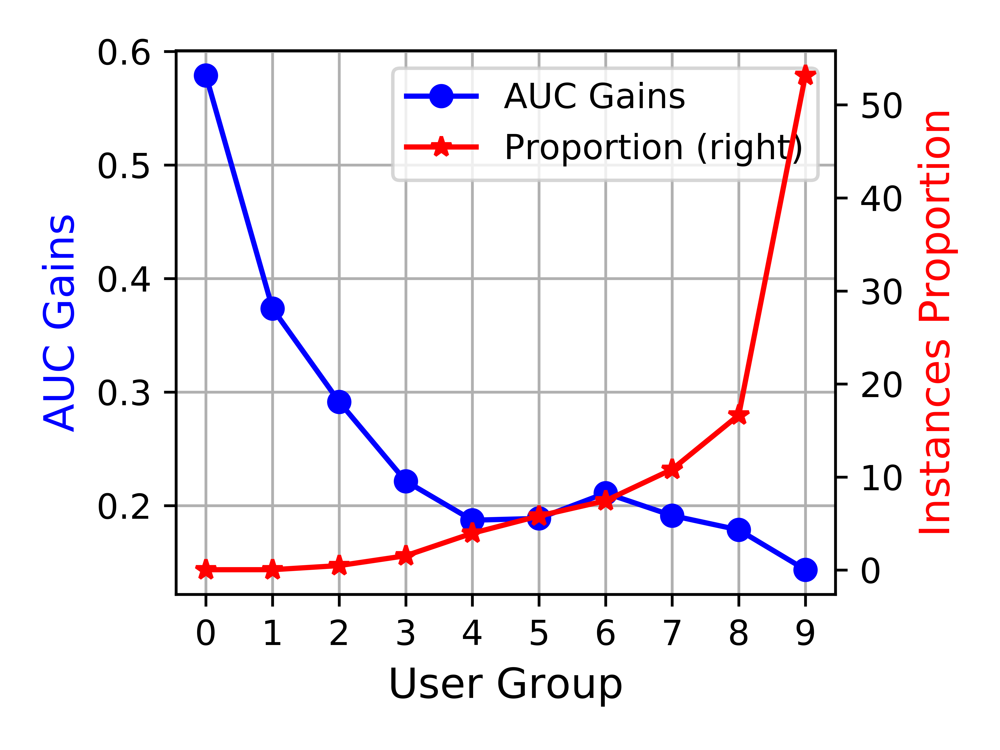
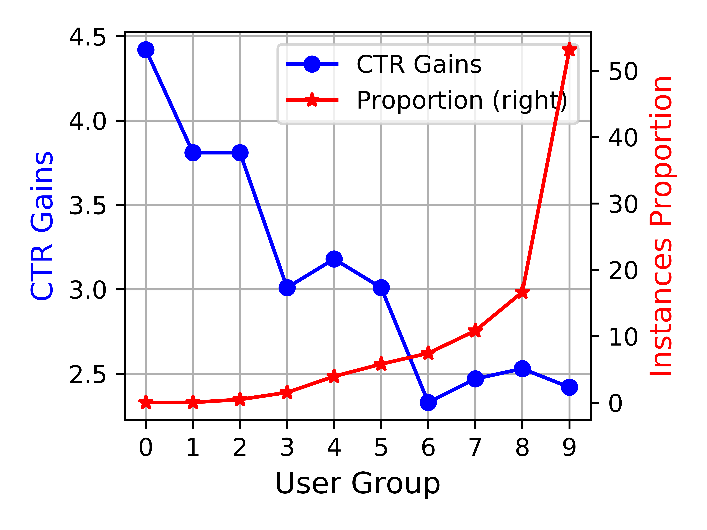

---
tags:
  - paper
  - parameter-generation
  - CTR
  - dynamic-network
  - recommendation
aliases:
  - APG
arxiv: "2203.16218"
year: 2022
venue: NeurIPS 2022
---

> **论文**：APG: Adaptive Parameter Generation Network for Click-Through Rate Prediction
> **作者**：Bencheng Yan*, Pengjie Wang*, Kai Zhang, Feng Li, Hongbo Deng, Jian Xu, Bo Zheng (*共同一作)
> **机构**：Alibaba Group (阿里妈妈)
> **发表**：NeurIPS 2022
> **阅读时长**：约 12 分钟
> **难度**：⭐⭐⭐ (需要推荐系统和深度 CTR 模型基础)
> **前置知识**：DeepFM/DCN 等 CTR 模型、低秩分解、动态网络概念
> **工业部署**：2021 年 12 月起在阿里巴巴直通车系统线上服务

## TL;DR

所有传统深度 CTR 模型用一套静态参数处理所有输入样本——冷启动用户和活跃用户共享同一组权重。APG 将静态权重替换为实例级动态生成的参数，通过低秩分解、分解前馈、参数共享、过参数化四步优化，最终实现比原始静态模型更快（-38.7% 训练时间）、更小（-96.6% 内存）、更准（+0.52% AUC）。在阿里巴巴线上实现 +3% CTR、+1% RPM。

## 论文概述

**问题**：传统深度 CTR 模型对所有输入使用同一套静态参数，无法针对不同用户/物品/场景做细粒度的参数适配。

**方案**：设计通用的即插即用模块 APG，将 $y_i = f_W(x_i)$ 变为 $y_i = f_{G(z_i)}(x_i)$——参数由生成网络 $G$ 根据条件 $z_i$ 动态产生。

**贡献**：
1. 提出实例级参数生成范式，可插入任何深度 CTR 模型（DeepFM、DCN、PNN 等），所有模型在所有数据集上均有提升
2. 四步渐进式优化将朴素参数生成从 111x 减速、31x 内存膨胀，优化到比静态模型更快更省
3. 在阿里巴巴直通车系统实现工业级部署，延迟 14.8ms，CTR +3%

## 背景与动机

### 静态参数的根本局限

考虑电商场景中的两类用户：
- 用户 A：冷启动，仅 2 次历史交互
- 用户 B：活跃用户，2000 次历史交互

传统 CTR 模型（DeepFM、DCN 等）用同一套权重矩阵处理这两类用户。模型被迫在差异巨大的特征分布之间寻找一个妥协的参数化方案——既不够精细地建模活跃用户的丰富兴趣，也不够鲁棒地处理冷启动用户的稀疏信号。

*图：冷启动用户与活跃用户的 CTR 分布差异——冷启动用户高度集中在低 CTR 区间，两类用户的特征分布存在显著差异*

*图：冷启动用户与活跃用户的年龄层分布对比——不同用户群体的属性分布明显不同，一套静态参数难以兼顾*

### 粗粒度方案的不足

| 方法 | 粒度 | 问题 |
|------|------|------|
| STAR | 按域（domain） | 粒度人工预定义；细粒度（item 级）时 IAAC 数据集需 13,753 MB 内存 |
| MMoE | 按任务（task） | 每个专家仍是静态参数；无法做到实例级 |
| DIFM | 按特征（feature） | 仅做特征级别的重加权，表达能力有限 |

### 朴素实例级参数生成：不可行

直接为每个样本生成完整权重矩阵 $W_i$：训练时间 ×111，内存 ×31。APG 的核心挑战在于让实例级参数生成的开销**低于**静态模型。

## 核心方法

### 核心公式

**标准深度 CTR 模型**：$y_i = f_W(x_i)$，参数 $W$ 对所有样本共享

**APG**：$y_i = f_{G(z_i)}(x_i)$，参数由生成网络 $G$ 根据条件 $z_i$ 动态生成

*图：APG 整体框架——条件信号 $z_i$ 经生成网络产生实例特定参数 $S_i$，与共享参数 $U^l, U^r, V^l, V^r$ 组合为动态权重 $W_i$，替换原始静态参数送入 DeepCTR 模型*

### 条件信号设计

三种策略：

1. **Group-wise**：按实例组（如用户群体）共享参数，条件为组标识
2. **Mix-wise**：聚合多个条件信号（拼接/均值池化/attention）
3. **Self-wise**：直接用上一层输出 $z_i = h_i^{l-1}$ 作为条件——无需领域知识，模型自主学习何种输入特征应驱动参数定制

### 四步优化：从不可行到超越静态

以下四步是**累积**的——每步在前一步基础上叠加：

*图：四步渐进式优化——从 (a) 静态参数 → (b) 朴素实例参数 → (c) 低秩分解 → (d) 参数共享 → (e) 过参数化，绿色为实例特定参数，黄色为全局共享参数*

#### Step 1: 低秩分解

不生成完整 $N \times M$ 权重矩阵，而是分解为三个矩阵：

$$W_i = U_i \cdot S_i \cdot V_i$$

其中 $U_i \in \mathbb{R}^{N \times K}$，$S_i \in \mathbb{R}^{K \times K}$，$V_i \in \mathbb{R}^{K \times M}$，$K \ll \min(N, M)$。

生成复杂度从 $O(NMD)$ 降至 $O((NK + MK + K^2)D)$。

#### Step 2: 分解前馈

数学上的恒等变换——避免重建完整 $W_i$ 矩阵：

$$y_i = \sigma(U_i \cdot (S_i \cdot (V_i \cdot x_i)))$$

右结合的矩阵乘法避免了 $N \times M$ 矩阵的构造，计算量从 $O(NK + K^2 + KM + NM)$ 降至 $O(NK + K^2 + MK)$。输出完全一致，仅影响速度。

*图：分解前馈示意——左侧为朴素方式（先重建 $W_i$ 再前馈），右侧为分解前馈（右结合逐步矩阵乘法，避免构造完整矩阵）*

#### Step 3: 参数共享（关键设计）

将分解矩阵分配不同角色：
- **$S_i$**：实例特定，动态生成（$S_i = \text{reshape}(\text{MLP}(z_i))$）
- **$U, V$**：全局共享，作为静态参数训练

$$y_i = \sigma(U \cdot (S_i \cdot (V \cdot x_i)))$$

生成开销从 $O((NK + MK + K^2)D)$ 骤降至 $O(K^2 D)$——只需生成小型 $K \times K$ 矩阵。

**反直觉的发现**：参数共享不仅降低开销，还**提升**了准确率（+0.40% vs 朴素方案的 +0.27%）。原因：共享的 $U, V$ 从全部数据的梯度信号中学习通用表示，$S_i$ 仅需建模实例间的残差差异。这种分工比"每个样本独立重新发现通用模式"更高效。

#### Step 4: 过参数化

训练时扩展共享参数的中间维度：

$$U = U^l \cdot U^r, \quad U^l \in \mathbb{R}^{N \times P}, U^r \in \mathbb{R}^{P \times K}, \quad P \gg K$$
$$V = V^l \cdot V^r, \quad V^l \in \mathbb{R}^{K \times P}, V^r \in \mathbb{R}^{P \times M}$$

训练时模型有更大的优化空间（更多参数参与梯度下降）。**推理时预乘为单一矩阵**（$U = U^l U^r$），零额外推理开销。

这是单步最大的准确率提升，将平均 AUC 增益推到 +0.52%。

*图：过参数化的训练与推理阶段对比——训练时 $U, V$ 各自分解为两个矩阵（红框）提供更大优化空间，推理时预乘回单一矩阵（黄色），零额外开销*

### 复杂度总览

| 版本 | 时间复杂度 | 内存复杂度 | AUC 增益 |
|------|-----------|-----------|----------|
| 静态基线 | $O(NM)$ | $O(NM)$ | — |
| v1 朴素 | $O(NMD)$ | $O(NMD)$ | +0.27% |
| v2 低秩 | $O((NK+MK+K^2)D)$ | $O((NK+MK+K^2)D)$ | +0.27% |
| v3 分解前馈 | $O((NK+K^2+MK)D)$ | 同 v2 | +0.27% |
| v4 参数共享 | $O(K^2D + NK + K^2 + MK)$ | $O(K^2D + NK + MK)$ | +0.40% |
| v5 过参数化 | 同 v4 | 同 v4 | **+0.52%** |

当 $K \ll \min(N, M)$ 时，最终 APG 的开销**低于**原始静态模型。

## 实验分析

### 主实验：APG 作为通用增强模块

APG 在**每个基线模型**的**每个数据集**上均有提升：

| 数据集 | 基线平均 AUC | APG 平均 AUC | 平均增益 |
|--------|-------------|-------------|----------|
| MovieLens | 79.47% | 79.72% | +0.24% |
| Amazon | 69.06% | 69.35% | +0.28% |
| IAAC（工业） | 65.26% | 66.16% | +0.91% |

突出个例：DCN on IAAC 从 64.78% 提升到 66.39%（+1.61%）。

**工业线上结果**：
- 离线 AUC +0.2%
- 在线 A/B 测试：CTR +3%，RPM +1%
- 服务延迟 14.8ms，PVR 影响 -0.01%（可忽略）

*图：不同用户活跃度分组的离线 AUC 增益——冷启动用户（Group 0）获益最大（+0.58%），活跃用户增益递减但始终为正*

*图：线上 A/B 测试中各用户分组的 CTR 增益——冷启动用户 CTR 提升超过 4%，验证了实例级参数生成对稀疏用户的适配能力*

### 四步优化的效率演进

层配置 [393, 1024, 512, 256] 上的测量：

| 版本 | 训练时间 (s/epoch) | 变化 | 内存 (MB) | 变化 |
|------|-------------------|------|----------|------|
| 静态基线 | 13.04 | — | 12.91 | — |
| v1 朴素 | 1462.78 | +11,118% | 419.11 | +3,146% |
| v3 分解前馈 | 11.23 | **-13.9%** | 3.22 | -75.1% |
| v4 参数共享 | **7.99** | **-38.7%** | **0.44** | **-96.6%** |

从 112 倍减速到 1.6 倍加速——这个演进过程本身就是论文的精华。

### vs 粗粒度方法

| 方法 | MovieLens AUC | 内存 |
|------|---------------|------|
| 静态基线 | 79.21% | 1.29 MB |
| STAR（细粒度） | 79.28% | 3,784 MB |
| MMoE（细粒度） | 79.31% | 123 MB |
| **APG（细粒度）** | **79.58%** | **0.24 MB** |

IAAC 上更极端：STAR 需要 13,754 MB，APG 仅需 0.38 MB——36,000 倍的内存优势。STAR 和 MMoE 本质上为每个粒度单元存储独立参数，而 APG 通过生成网络共享参数空间。

### 参数空间可视化

*图：Amazon 数据集上 10 个电子产品子类别的生成参数 $S_i$ 的 PCA 可视化——语义相似的类目（如 Computers & Accessories、Television & Video）在参数空间中自然聚类，虚线圆圈标注了三个明显的语义簇*

对 Amazon 数据集上 10 个商品类别的生成 $S_i$ 矩阵做 PCA，发现：
- 电子产品类目在参数空间中自然聚类
- 图书类目形成另一个独立簇
- 语义相似的类目在参数空间中也相近

APG 在没有显式类目监督的情况下，学到了语义有意义的参数变化。

## 深度理解问答

### Q1: 为什么参数共享反而提升了准确率？

这是论文最反直觉的发现。朴素方案（v1）为每个样本独立生成所有参数，意味着通用模式必须在每个输入上被重新发现。

指定 $U, V$ 为共享参数后，模型显式学习一个通用的表示骨架（受益于全部数据的梯度信号），$S_i$ 只需捕捉实例间的残差差异。这种分工在统计学习意义上更高效——共享参数提供稳定的基础，实例参数在此基础上做精细调整，避免了"独立重建轮子"的冗余。

本质上，这是一种归纳偏置："大部分变换是共享的，只有小型 $K \times K$ 分量因实例而异。"

### Q2: APG 如何实现比静态模型更低的开销？

关键是 $K \ll \min(N, M)$。以 $N=1024, M=512$ 的层为例：

- 静态模型内存：$NM = 524,288$
- APG 内存：$K^2 D + NK + MK$（取 $K=4, D=32$）$= 512 + 4096 + 2048 = 6,656$

约 80 倍的内存节省。生成网络（MLP 产生 $K^2 = 16$ 个值）极小，共享的 $U, V$ 矩阵（$NK + MK$）也远小于原始 $NM$ 矩阵。

### Q3: 为什么选 $S_i$ 而非 $U_i$ 或 $V_i$ 作为实例特定分量？

$S_i$ 位于低秩分解的"瓶颈"位置，是最小的矩阵（$K \times K$），生成开销最低（$O(K^2 D)$ vs $O(NKD)$ 或 $O(KMD)$）。

更深层的原因：$S_i$ 是输入投影空间（由 $V$ 定义）和输出投影空间（由 $U$ 定义）之间的混合/缩放矩阵。$S_i$ 的微小变化可以通过重新加权共享投影来产生多样化的变换——以最小的参数量获得最大的杠杆效应。

### Q4: 过参数化如何做到"训练增益、推理零开销"？

训练时 $U$ 分解为 $U^l \cdot U^r$，中间维度 $P \gg K$。这给优化器提供了更多参数，改善了 $U$ 的学习质量。

但 $U^l$ 和 $U^r$ 都是静态的（非实例依赖），可以在部署前预乘为单一矩阵 $U = U^l U^r$。推理模型的维度（$N \times K$）与无过参数化完全一致——训练成本离线吸收，服务模型不增加任何开销。

### Q5: APG 与 hypernetwork 是什么关系？

APG 在概念上是 hypernetwork 的一种形式——一个网络生成另一个网络的参数。关键区别：
1. APG 在实例级生成参数（不是任务级）
2. 低秩分解 + 共享/特定分离是为在线 CTR 系统的计算约束（<20ms 延迟、数十亿样本）专门设计的
3. 过参数化训练技巧是本文的独特贡献

论文将 APG 定位为"将动态网络思想引入深度 CTR 模型的第一步"。

## 总结

### 核心贡献
- 证明实例级参数生成在 CTR 场景下可行且优于静态模型——准确率更高、速度更快、内存更省
- 四步渐进式优化是教科书级的工程与理论结合：每步有明确的数学动机和实证验证
- 作为通用即插即用模块，对所有测试过的 CTR 模型均有效
- 在阿里巴巴线上系统实现工业级部署验证

### 局限性
- 超参数配置（条件策略选择、秩 $K$、过参数化因子 $P$）需要调优，自动配置留作未来工作
- Group-wise 和 Mix-wise 条件设计需要领域知识
- 公开数据集上 AUC 绝对提升幅度较小（0.24%-0.91%），但在工业场景收益显著（CTR +3%）
- 未讨论失败场景——如实例确实应该共享参数时，或条件信号信息量不足时的表现

### Blog 补充视角

腾讯云博客提供了几个论文中没有的有价值视角：
- **"千样本千模"**的比喻生动概括了 APG 的核心野心——为每个样本生成独特模型
- 博客评价方法"优雅"且"实现难度不大"，暗示最终模块易于集成到现有代码库
- **"平衡个性化与通用模式学习，防止过度特化"**——共享参数实质上是正则化器，无限制的个性化反而有害。论文暗示了这一点但从未直接表述

### 相关论文
- [[LoRA-Gen]]：同为参数生成范式，但在 LLM 场景下实现云-端协同的 LoRA 在线生成
- [[IGPG]]：将参数生成建模为自回归序列问题，支持跨架构生成，代表了这一方向的最新进展
