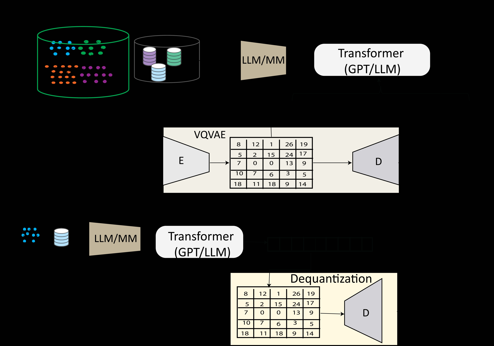
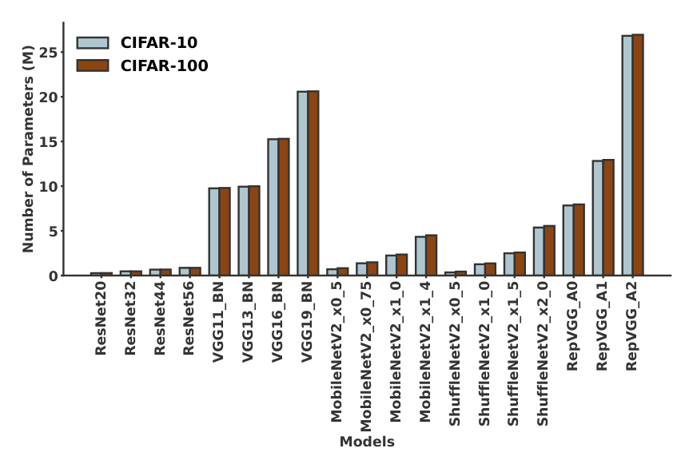
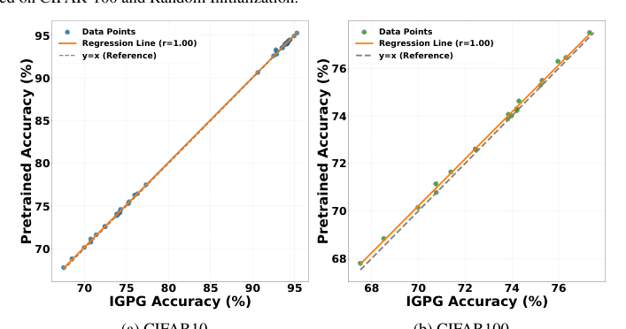
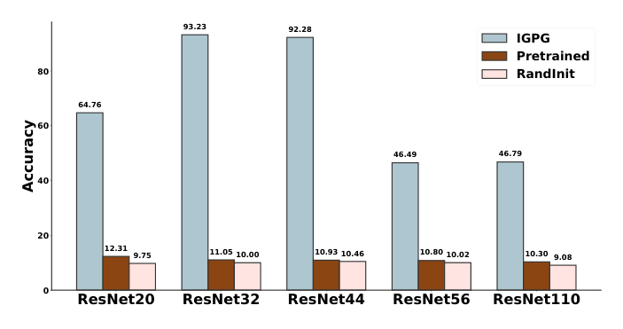
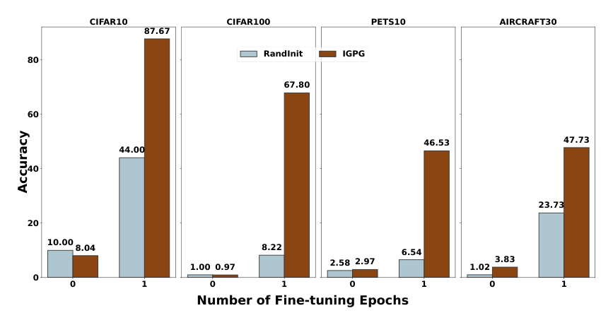

---
tags:
  - paper
  - parameter-generation
  - autoregressive
  - VQ-VAE
  - hypernetwork
aliases:
  - IGPG
arxiv: "2504.02012"
year: 2025
venue: arXiv preprint
---

> **论文**：Instruction-Guided Autoregressive Neural Network Parameter Generation
> **作者**：Soro Bedionita, Bruno Andreis, Song Chong, Sung Ju Hwang
> **机构**：KAIST AI / DeepAuto.ai
> **发表**：arXiv 2025.04
> **阅读时长**：约 18 分钟
> **难度**：⭐⭐⭐⭐⭐ (涉及 VQ-VAE、自回归建模、跨架构泛化等多个前沿方向)
> **前置知识**：VQ-VAE 离散化、GPT 自回归生成、CLIP 视觉-语言对齐、LoRA

## TL;DR

IGPG 将"生成神经网络权重"建模为一个序列生成问题：先用 Gumbel VQ-VAE 将连续权重向量 tokenize 为离散 codebook 序列，再用 GPT-2 基于自然语言指令（CLIP 数据集 embedding + LLaMA-3 架构 embedding）自回归生成这些 token，最后解码回可用权重。框架支持 CNN、ViT、MobileNet 等多种架构（最大 27M 参数），生成的权重接近预训练水平，且提供比随机初始化快得多的收敛速度。

## 论文概述

**问题**：能否从自然语言描述直接生成神经网络参数——跳过梯度训练，实现"描述即得到模型"？

**方案**：三阶段流水线——VQ-VAE 权重 tokenization → GPT-2 条件自回归生成 → 解码还原权重。通过多阶段生成机制扩展到任意大小的架构。

**贡献**：
1. 首个将权重生成建模为"tokenize + 自回归预测"的框架，自然捕捉层间依赖关系
2. 通过 CLIP + LLaMA-3 双重条件化，实现基于自然语言指令的跨任务、跨架构参数生成
3. 多阶段生成机制突破 Transformer 上下文窗口限制，支持数百万参数量级的模型生成

## 背景与动机

### 从"训练参数"到"生成参数"

传统深度学习流程：定义架构 → 随机初始化 → 梯度优化数千步。如果有一个"参数生成器"能从任务描述直接输出可用权重，就能跳过漫长的训练过程。

### 现有方案的瓶颈

**Hypernetworks**：从隐变量生成权重，但通常与特定架构绑定，且生成的权重仅作为初始化，仍需后续完整训练。

**扩散模型（D2NWG）**：在连续权重空间上学习分布，效果不错但有根本缺陷——扩散过程对所有位置独立去噪，无法建模层间依赖。当参数量增大时，这种独立性假设导致质量下降。

**Hyper-representation 方法（SANE、SKDE）**：需要按架构族单独训练，缺乏统一框架。

### 自回归的优势

神经网络权重具有天然的序列结构——层有顺序，后层功能依赖前层。自回归模型通过"每个 token 条件于所有前序 token"的方式自然捕捉这种依赖，而扩散模型将所有位置视为条件独立。

## 核心方法

### 整体流程


*图：IGPG 整体框架——VQ-VAE 将权重 tokenize 为离散序列，GPT-2 基于任务和架构条件自回归生成 token，解码器还原为可用权重*

```
任务描述 + 架构规格 → [CLIP + LLaMA-3 编码] → 条件 embedding
                                                      ↓
                                              [GPT-2 自回归生成]
                                                      ↓
                                              codebook token 序列
                                                      ↓
                                              [VQ-VAE 解码器]
                                                      ↓
                                              可用的神经网络权重
```

### Phase 1: VQ-VAE 权重 Tokenization

**参数向量化**：将目标网络的权重展平，padding 到 $D' = \lceil D/K \rceil \times K$，分成 $n = D'/K$ 个大小为 $K$ 的 chunk。

**Gumbel-Softmax 量化**（替代标准 VQ-VAE 的 argmin）：

$$z_q = \sum_{j=1}^{m} y_j \cdot e_j, \quad y_j = \frac{\exp((\log \pi_j + g_j) / \tau)}{\sum_{i=1}^{m} \exp((\log \pi_i + g_i) / \tau)}$$

- $\{g_j\}$：Gumbel 噪声样本
- $\tau$：温度参数（从 1 循环退火到 $10^{-4}$）
- $m$：codebook 大小

相比标准 VQ-VAE 的 straight-through estimator，Gumbel-Softmax 提供完全可微的离散化，避免梯度偏差。温度退火在训练早期保持探索性，晚期逐渐趋近硬选择。

**训练损失**：

$$\mathcal{L} = \|M \odot (\theta - \hat{\theta})\|_2^2 + \gamma \|z - \text{sg}[z_q]\|_2^2 + \beta \|\text{sg}[z] - z_q\|_2^2$$

三项分别为：重建损失（带 padding mask $M$）、commitment loss、codebook loss。

**模型规模**：编码器 197M，解码器 198M，量化模块 132K 参数。

### Phase 2: 条件自回归建模

**数据集条件化**：对目标任务采样平衡子集（每类 5 张图），通过 CLIP 编码后 mean-pooling 得到数据集 embedding $e_D$。

**架构条件化**：将架构规格转为标准化文本描述 $\text{desc}(A)$，通过 LLaMA-3-Instruct 生成架构 embedding $e_A$。

**Transformer Prior**：GPT-2（27.8M 参数）建模条件 token 序列分布：

$$\mathcal{L}_{prior} = \mathbb{E}_{s \sim p(s, e_A, e_D)} [\log p(s \mid e_A, e_D)]$$
$$p(s \mid e_A, e_D) = \prod_i p(s_i \mid s_{<i}, e_A, e_D)$$

$e_D$、$e_A$ 和 VQ-VAE codebook embedding 拼接为统一的输入表示。

### Phase 3: 参数生成与解码

VQ-VAE 定义 tokenizer $T: \mathbb{R}^K \to \mathcal{V}^l$，将每个 chunk 映射到 $l$ 个 token。完整参数向量变为 $k \times l$ 个 token 的序列。

**单阶段生成**（当 $k \times l \leq N_{max}$）：
1. GPT-2 自回归生成 $s \in \mathcal{V}^{k \times l}$
2. 分割为 $k$ 段，每段 $l$ 个 token
3. VQ-VAE 解码器逐段解码为权重 chunk
4. 拼接还原完整参数向量

**多阶段生成**（当 $k \times l > N_{max}$）：
1. 生成初始 block $s^{(1)} \in \mathcal{V}^{N_{max}}$
2. 迭代生成后续 block，每个 block 以前一 block 的尾部上下文窗口为条件
3. 拼接所有 block，截断到 $k \times l$ token 后解码

多阶段机制突破了 Transformer 上下文窗口限制，理论上可生成任意大的网络。

### 设计选择的理由

| 选择 | 替代方案 | 理由 |
|------|----------|------|
| 自回归 | 扩散 | 自然保留层间顺序依赖；扩散对所有位置独立去噪 |
| Gumbel-Softmax VQ | 标准 VQ | 完全可微，避免 straight-through estimator 的梯度偏差 |
| CLIP + LLaMA 条件化 | 简单 one-hot | 利用预训练表示实现零样本跨任务/架构泛化 |
| 固定大小 chunking | 变长 | 统一处理流程，用 mask 处理 padding |

## 实验分析

### Tiny Model Zoo（2.5K-10.9K 参数的小型 CNN）

零样本生成（epoch 0，不做任何梯度更新）：

| 方法 | MNIST | SVHN | CIFAR-10 | STL-10 |
|------|-------|------|----------|--------|
| 随机初始化 | ~10% | ~10% | ~10% | ~10% |
| SANE_SUB | 86.7% | 72.3% | 57.9% | 43.5% |
| D2NWG | 80.5% | 66.6% | 58.8% | 44.5% |
| **IGPG** | **83.2%** | **67.1%** | **58.3%** | **44.4%** |

IGPG 在 MNIST 上落后于 SANE_SUB，但在其他数据集上与 D2NWG 持平。训练 25 epoch 后：MNIST 94.5%、SVHN 76.9%、CIFAR-10 63.9%、STL-10 49.1%。

### LoRA 生成（ViT-Base，6 个视觉 benchmark）

| 方法 | OxfordPets | Cars | CIFAR10 | DTD | EuroSAT | FGVC | 平均 |
|------|-----------|------|---------|-----|---------|------|------|
| LoRA | 93.2 | 45.4 | 98.8 | 75.0 | 98.4 | 25.2 | 72.7 |
| FourierFT | 93.2 | 46.1 | 98.6 | 75.1 | 98.3 | 27.5 | 73.1 |
| **IGPG** | **92.8** | **57.7** | **98.5** | **88.7** | **98.7** | **36.6** | **78.8** |

IGPG 在平均准确率上超过 FourierFT 5.7 个百分点，在 DTD（+13.7）和 StanfordCars（+11.6）上提升显著。

### 多架构生成（19 种架构，0.27M-27M 参数）

在 CIFAR-10 上，IGPG 生成的模型准确率（93.74%）与预训练模型（93.76%）几乎一致。生成准确率与预训练准确率的 Pearson 相关系数达到 0.9999（CIFAR-10）和 0.9991（CIFAR-100），说明 IGPG 忠实再现了不同架构的性能梯度。


*图：19 种架构在 CIFAR-10/CIFAR-100 上的参数量分布（0.27M-27M），展示 IGPG 支持的架构多样性*


*图：IGPG 生成权重的准确率与预训练准确率的相关性——CIFAR-10（r=1.00）和 CIFAR-100（r=1.00），回归线几乎与 y=x 重合*

### 跨架构泛化

在 125 个 ResNet-56 变体（block 配置从 [4,4,4] 到 [8,8,8]）上训练后：
- 分布内架构：与预训练 baseline 持平
- 分布外架构（ResNet-20、ResNet-110）：超越所有 baseline，但绝对准确率仍远低于预训练水平（约 46%）


*图：IGPG 在已见（ResNet-32/44）与未见（ResNet-20/56/110）架构上的 CIFAR-10 准确率对比，分布内架构接近预训练水平*

### 迁移学习

单个 IGPG 模型在 30 个 Meta-Album 数据集上训练后，在未见的 CIFAR-10 和 Oxford Pets 上，生成的模型在 1 个 epoch 内即实现超过 50% 的相对提升，展现快速适应能力。


*图：迁移学习评估——IGPG 生成的权重在 CIFAR10/CIFAR100/PETS10/AIRCRAFT30 上仅 1 epoch 微调即大幅超越随机初始化*

### 分布学习保真度

VQ-VAE 重建和 IGPG 采样的准确率与预训练模型差距在 0.01-0.03 个百分点以内，说明 tokenization 和生成过程几乎无损。

## 深度理解问答

### Q1: 为什么用自回归而不是扩散模型生成权重？

神经网络权重有天然的顺序结构——层是有序的，后层功能依赖前层。自回归模型通过 $p(s_i | s_{<i})$ 条件化天然编码了这种依赖。扩散模型同时去噪所有位置，隐含地假设各位置条件独立，无法建模层间结构。

实证上，IGPG 在大多数 benchmark 上匹配或超过 D2NWG，且通过多阶段机制更好地扩展到大型架构。

### Q2: Gumbel-Softmax 相比标准 VQ-VAE 有什么优势？

标准 VQ-VAE 的 argmin 操作不可微，需要 straight-through estimator 引入梯度偏差。Gumbel-Softmax 提供可微的分类采样松弛，使梯度可以平滑地流过量化步骤。

温度退火（从 1 到 $10^{-4}$）在训练早期保持"软"分配（探索），后期逼近"硬"分类选择（精确量化）。对于权重生成尤其重要——小的重建误差会在层间累积放大。

### Q3: CLIP 和 LLaMA-3 条件化各自贡献了什么？

CLIP 通过编码少量代表性样本（每类 5 张图），捕获目标任务的视觉分布特征——实质上回答"这是什么任务"。LLaMA-3 处理架构的文本描述，编码结构信息（层数、block 配置、通道宽度）——回答"要生成什么架构"。

两者结合使 Transformer Prior 能解耦"什么任务"和"什么架构"。但论文缺少移除任一条件信号的消融实验，两者的边际贡献未被直接测量——这是评估上的一个遗憾。

### Q4: 多阶段生成如何避免跨阶段的误差累积？

每个后续阶段不仅以 $(e_A, e_D)$ 为条件，还以前一阶段输出的尾部上下文窗口为条件。这种重叠上下文提供了连续性，类似滑动窗口语言模型保持连贯性。

论文未显式分析跨阶段误差累积，但最大模型（VGG19-BN，20.57M 参数）的准确率仍接近预训练水平，表明多阶段机制在实践中运作良好。

### Q5: IGPG 相比直接微调预训练模型有什么实际价值？

三个场景：
1. **模型压缩**：单个 IGPG 系统（约 423M 参数）可再现整个模型动物园，作为多个 checkpoint 的紧凑表示
2. **快速适应**：在未见任务上 1 epoch 内 50%+ 相对提升，比随机初始化节省大量训练计算
3. **LoRA 生成**：无需逐任务梯度优化，平均 78.8% vs FourierFT 的 73.1%

主要限制是训练 IGPG 系统本身需要大量预训练模型集合。

## 总结

### 核心贡献
- 首次将权重空间建模为 "tokenize → 自回归生成" 的序列问题，对层间依赖的建模优于扩散方法
- CLIP + LLaMA 双重条件化实现了基于自然语言的跨任务、跨架构参数生成
- 多阶段生成突破上下文窗口限制，验证了生成数百万参数的可行性
- LoRA 生成场景超越标准 LoRA 和 FourierFT，平均提升 5.7 个百分点

### 局限性
- 需要大规模预训练模型集合作为训练数据，目前缺乏公开的标准化模型仓库
- 零样本迁移（epoch 0）在未见任务上接近随机初始化，价值在于"快速收敛"而非"即用即走"
- 分布外架构泛化的绝对准确率仍远低于预训练（如 ResNet-110 约 46%）
- 仅在视觉任务上验证，NLP 等其他模态未涉及
- 缺少计算时间的详细对比

### 相关论文
- [[LoRA-Gen]]：同为参数生成框架，但聚焦云-端协同的 LoRA 在线生成，通过 MoE 路由实现任务特化
- [[APG]]：参数生成在推荐系统中的先驱工作，实例级动态生成实现个性化建模
