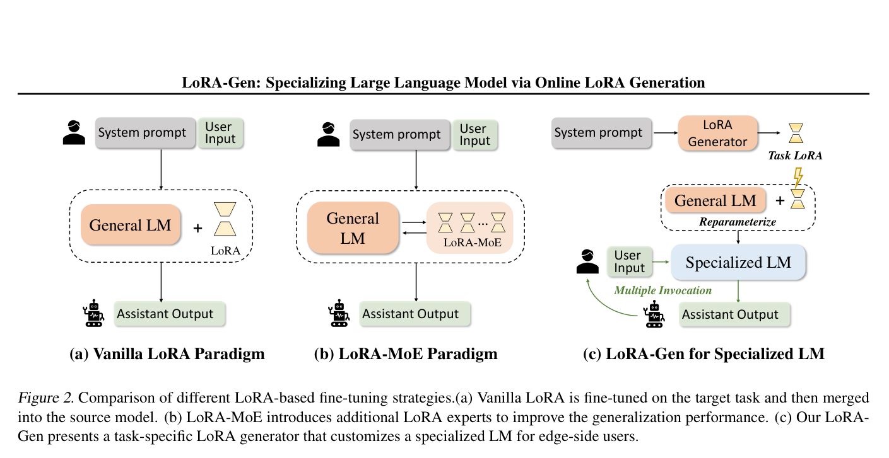
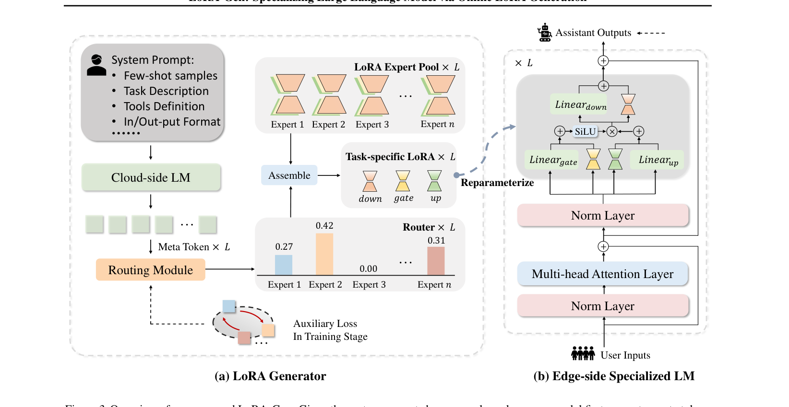
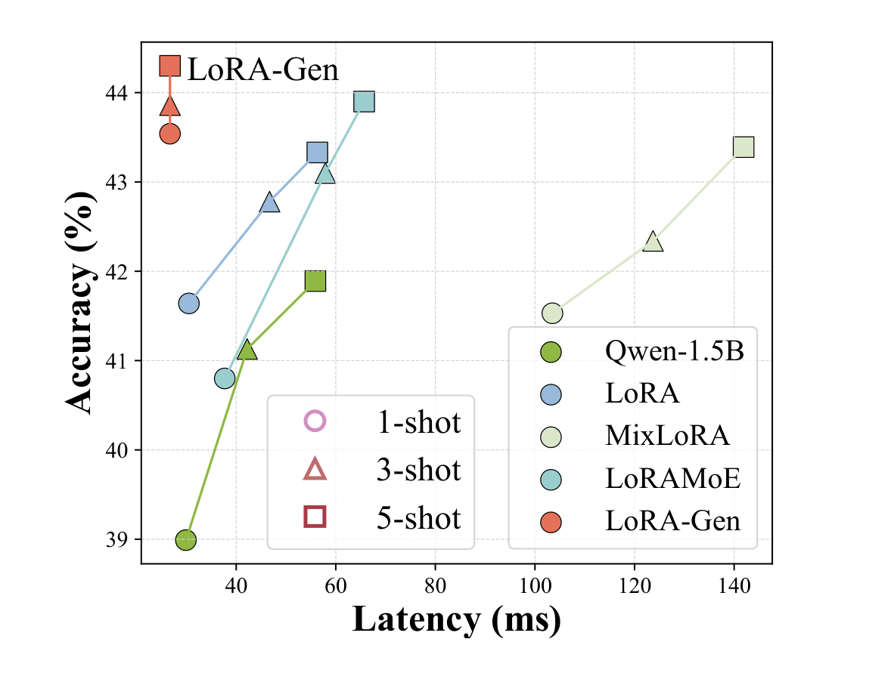

---
tags:
  - paper
  - simplified
aliases:
  - LoRA-Gen 简明版
---

# LoRA-Gen —— 大模型为小模型在线生成任务适配器

> 原始论文笔记：[LoRA-Gen](LoRA-Gen.md)

## 一句话总结

云端大模型（LLaMA3-8B）读取任务描述后，通过一次前向传播生成一组 LoRA 参数，直接合并到边缘小模型的权重中。合并后小模型不需要再处理原始的任务描述文本，推理速度提升 2 倍，上下文压缩 10 倍。

## 问题背景

在手机、IoT 设备等资源受限的终端上部署 LLM，面临两个矛盾：

1. **任务特化需要上下文**：不同任务需要不同的 system prompt（任务说明、few-shot 示例、工具定义），这些 prompt 可能占据输入的 80%+，每个 token 都要经过全部 Transformer 层计算
2. **现有适配方案各有瓶颈**：
   - LoRA 微调：每个任务都要单独训练，无法即时切换
   - LoRA-MoE（如 MixLoRA）：引入 token 级路由，每生成一个 token 都要过路由网络，延迟反而增加（100ms vs 原始 44ms）
   - 软 prompt 压缩（如 Gisting）：压缩后的 soft token 仍在输入序列中，attention 计算量未真正减少

核心矛盾：**信息压缩后仍然存在于输入序列中**，无法真正消除推理开销。

*三种 LoRA 范式对比：(a) Vanilla LoRA 逐任务训练；(b) LoRA-MoE 引入 token-wise 路由但增加推理开销；(c) LoRA-Gen 由云端大模型一次前向生成 LoRA 参数*

## 核心方案

LoRA-Gen 的关键洞察：如果把任务信息编码为权重增量 $\Delta W = AB$，通过 LoRA 重参数化合并进模型：

$$\tilde{W} = W + AB, \quad A \in \mathbb{R}^{d' \times r},\ B \in \mathbb{R}^{r \times d''}$$

合并后的模型在架构和计算量上与原模型**完全一致**——信息被吸收进权重，而非留在输入中。

### 两阶段流程

*LoRA-Gen 整体架构：(a) 云端生成器从 system prompt 产生 meta token，经路由模块组合 LoRA 专家；(b) 边缘端将 LoRA 参数合并进 FFN 层，推理零额外开销*

**阶段一：云端生成 LoRA**
1. 云端大模型处理任务 system prompt，在末尾附加 $L$ 个特殊 meta token（$L$ = 边缘模型层数）
2. 每个 meta token 通过 causal attention 聚合整段 prompt 的语义
3. 路由模块对每个 meta token 做 TOP-2 专家选择，从 8 个共享 LoRA 专家中加权组合出该层的 LoRA 参数

**阶段二：边缘端零开销推理**
- 生成的 LoRA 参数合并进小模型权重
- 推理时无路由、无额外 token、无 MoE 开销

### 两个关键设计

**Layer-wise 路由（非 token-wise）**：路由模块对每个 meta token 计算专家权重：

$$R^i = \text{BN}(f_2 \circ \sigma \circ f_1(T_i^{meta}))$$

路由决策在生成阶段按层做一次，而非推理时每个 token 都做。这使得路由结果可以固化进权重。最终每层的 LoRA 参数为：

$$\theta^i = \sum_{j=1}^{n} G^i \cdot E_j$$

**离散专家池（非连续投影）**：将 meta token 映射到离散专家组合，而非直接投影到连续权重空间。这约束了输出空间，起到正则化效果——未见任务的准确率从 61% 提升到 72%。

## 实验结果

*准确率-延迟散点图：LoRA-Gen（红色）在所有配置下均位于帕累托前沿左上方*

- **推理速度**：TinyLLaMA-1.1B 上延迟从 44.5ms 降到 21.2ms（2.1x 加速）
- **Agent 场景**：Gemma-2B 上实现 10.1x 上下文压缩，不需要在 prompt 中放工具定义就能正确调用工具
- **跨规模知识迁移**：1-shot LoRA-Gen（57.4%）超过 5-shot 传统 LoRA（53.9%），说明大模型注入了超越字面信息的知识
- **vs 软压缩**：比 AutoCompressors 准确率高 1.5%，速度快 1.5x

## 局限

- 每次任务特化需要云端大模型做一次前向传播（有网络延迟和算力依赖）
- 训练成本约为标准 LoRA 的 3.5 倍（用零样本泛化来摊还）
- 仅在 1.1B-2.7B 文本模型上验证，更大规模和多模态场景未知
