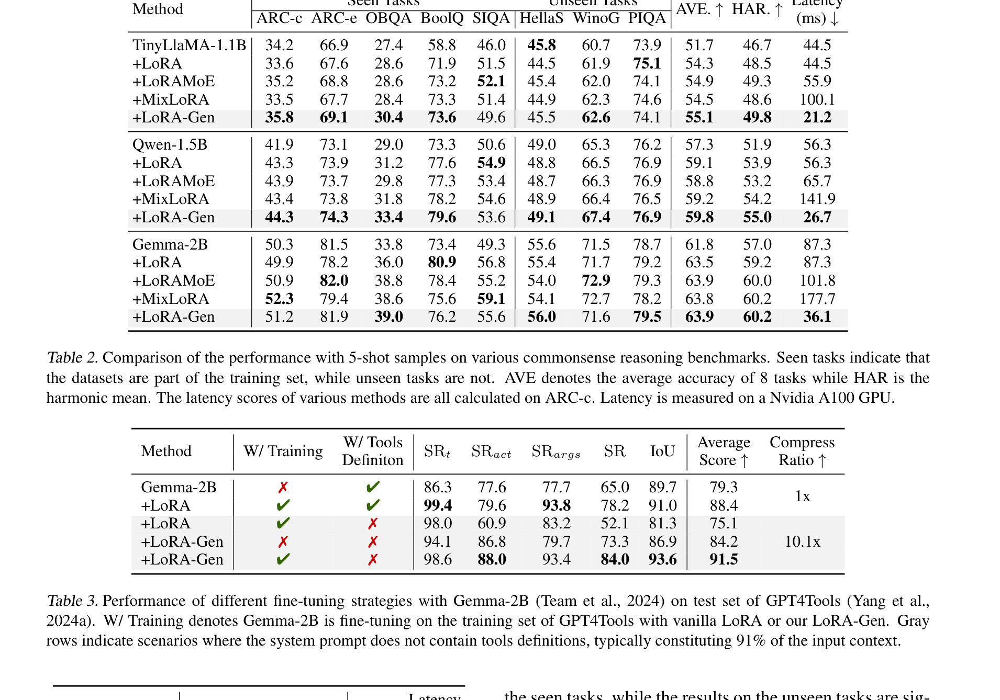
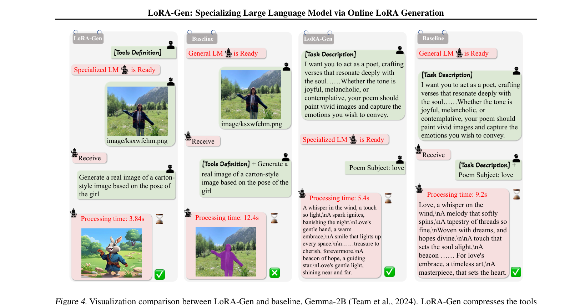

---
tags:
  - paper
  - parameter-generation
  - LoRA
  - cloud-edge
  - model-compression
aliases:
  - LoRA-Gen
arxiv: "2506.11638"
year: 2025
venue: arXiv preprint
---

> **论文**：LoRA-Gen: Specializing Large Language Model via Online LoRA Generation
> **作者**：Yicheng Xiao, Lin Song, Rui Yang, Cheng Cheng, Yixiao Ge, Xiu Li, Ying Shan
> **机构**：Tencent ARC Lab / 清华大学
> **发表**：arXiv 2025.06
> **阅读时长**：约 15 分钟
> **难度**：⭐⭐⭐⭐ (需要 Transformer、LoRA、MoE 基础)
> **前置知识**：LoRA 低秩适配、Mixture-of-Experts 路由机制、知识蒸馏概念

## TL;DR

边缘设备部署 LLM 面临效率与效果的矛盾——传统 LoRA 需要逐任务训练且无法压缩长 system prompt。LoRA-Gen 提出云端大模型（LLaMA3-8B）通过一次前向传播为边缘小模型（TinyLLaMA-1.1B 等）生成任务专属的 LoRA 参数，将 system prompt 压缩进权重后完全消除推理开销，在推理任务上实现 2.1x 加速，在 agent 任务上实现 10.1x 上下文压缩。

## 论文概述

**问题**：边缘设备上的小模型需要处理不同任务的长 system prompt（任务描述、few-shot 示例、工具定义），但逐 token 处理这些 prompt 带来巨大延迟开销；传统 LoRA 微调又需要逐任务训练，无法泛化到未见任务。

**方案**：设计云-端协同框架——云端大模型将任务 prompt 的知识"蒸馏"为一组 LoRA 参数，直接合并进边缘模型权重，实现零额外推理开销的任务特化。

**贡献**：
1. 提出 layer-wise MoE 路由机制，用 meta token 驱动专家选择，避免 token-wise 路由的逐 token 开销
2. 用离散专家池替代直接权重投影，大幅提升对未见任务的泛化能力（72.1% vs 61.0%）
3. 实现跨模型规模的知识迁移——1-shot LoRA-Gen 超越 5-shot 传统 LoRA

## 背景与动机

### 现有方法的困境

将 LLM 部署到资源受限的边缘设备，需要同时解决两个问题：模型要够小（参数量）、推理要够快（上下文长度）。现有方案各有短板：

| 方法 | 问题 |
|------|------|
| 传统 LoRA 微调 | 每个任务单独训练，无法泛化到未见任务；system prompt 仍需逐 token 处理 |
| LoRA-MoE（MixLoRA 等） | token-wise 路由导致每个生成 token 都要过路由网络，MixLoRA 延迟 100.1ms vs vanilla 44.5ms |
| 软 prompt 压缩（Gisting 等） | 压缩后的 soft token 仍在输入序列中，每层 attention 仍需计算额外开销 |
| LoraHub | 每个 LoRA 模块需独立训练，无法跨模型规模迁移 |

根本原因：这些方法要么无法压缩上下文，要么压缩后的信息仍存在于输入序列中，无法被"吸收"进模型权重。

*图：三种 LoRA 微调范式对比——(a) Vanilla LoRA 逐任务训练，(b) LoRA-MoE 引入 token-wise 路由但增加推理开销，(c) LoRA-Gen 由云端大模型一次前向生成任务专属 LoRA 参数*

### LoRA-Gen 的关键洞察

如果能把 system prompt 的知识编码为 LoRA 权重的增量 $\Delta W = AB$，合并后边缘模型的架构和计算量与原模型完全一致——真正的零开销压缩。

## 核心方法

### 整体架构

*图：LoRA-Gen 整体架构——(a) 云端 LoRA 生成器：system prompt 经大模型编码后产生 meta token，通过路由模块从专家池中组合 LoRA 参数；(b) 边缘端特化模型：生成的 LoRA 参数重参数化合并进 FFN 层，推理时零额外开销*

框架分两阶段运行：

**阶段一（云端 LoRA 生成）**：
1. 云端 LLaMA3-8B 接收任务 system prompt
2. 在 prompt 末尾附加 $L$ 个 `<meta>` token（$L$ = 边缘模型层数）
3. 通过 causal attention，每个 meta token 吸收完整 prompt 上下文信息
4. meta token 经路由模块从共享专家池中选择并组合 LoRA 参数

**阶段二（边缘端重参数化推理）**：
1. 生成的 LoRA 参数通过 $\tilde{W} = W + AB$ 合并进边缘模型
2. 合并后模型架构不变、推理开销不变
3. 无路由、无额外 token、无 MoE 计算

### Meta Token 生成

云端 LM 在 system prompt 后附加 $L$ 个特殊 `<meta>` token：

$$T_1^{meta}, T_2^{meta}, \dots, T_L^{meta}$$

每个 $T_i^{meta}$ 对应边缘模型第 $i$ 层 Transformer，通过 causal attention 自然地编码了整个 prompt 的语义信息，形成层级化的任务知识表示。

### 离散 LoRA 专家池

直接从 meta token 投影到连续 LoRA 权重矩阵会导致严重过拟合（未见任务上 61.0%）。LoRA-Gen 采用离散 MoE 方案：

- **专家池**：$n = 8$ 个 LoRA 专家，每个专家包含 3 个 LoRA block（分别作用于 FFN 的 gate、up、down 线性层）
- **所有专家端到端联合训练**，而非像 LoraHub 那样独立训练

### Layer-wise MoE 路由

路由模块处理每个 meta token，生成专家选择权重：

$$R^i = \text{BN}(f_2 \circ \sigma \circ f_1(T_i^{meta}))$$

- $f_1, f_2$：线性投影
- $\sigma$：SiLU 激活
- BN：批归一化

关键设计：**路由是 layer-wise 的**——每层只做一次专家选择决策（基于 meta token），而非 token-wise 的逐 token 路由。这使得路由结果可以被"烘焙"进权重，推理时完全消除。

### KeepTOP-K 专家选择（K=2）

确定性 TOP-K 选择优于 Gumbel-Softmax（58.7% vs 56.4%），因为随机性会损害任务特化的确定性：

$$G_t^i = \begin{cases} R_t^i / \sum_j \text{TOP-K}(R^i) & \text{if } R_t^i \in \text{TOP-K}(R^i) \\ 0 & \text{otherwise} \end{cases}$$

### 生成 LoRA 权重与合并

第 $i$ 层的 LoRA 参数为专家的加权组合：

$$\theta^i = \sum_{j=1}^{n} G^i \cdot E_j$$

最终通过标准 LoRA 重参数化合并：$\tilde{W} = W + AB$，其中 $A \in \mathbb{R}^{d' \times r}$，$B \in \mathbb{R}^{r \times d''}$，秩 $r = 16$。

### 训练细节

- **辅助负载均衡损失**：$\mathcal{L}_{cv} = \alpha \cdot (\sigma(G) / \mu(G))^2$，$\alpha = 0.01$，防止专家坍缩
- **总损失**：$\mathcal{L} = \mathcal{L}_{cv} + \mathcal{L}_{LM}$
- 优化器 AdamW，学习率 $2 \times 10^{-5}$，batch size 64，训练 4 epoch
- 训练数据：37,658 条 Alpaca 样本（经 GPT-4 抽象化处理）
- 硬件：8×64GB NPU（训练），A100（评估）

## 实验分析

### 推理任务：准确率与延迟双赢

*图：准确率-延迟散点图——LoRA-Gen（红色）在所有 shot 设置下均位于帕累托前沿左上方，兼顾高准确率与低延迟；MixLoRA（黄绿色）因 token-wise 路由延迟显著增大*

在 8 个推理 benchmark（ARC、BoolQ、HellaSwag 等）上的 5-shot 评估：

| 方法 | TinyLLaMA-1.1B AVE | 延迟 (ms) | Qwen-1.5B AVE | Gemma-2B AVE |
|------|---------------------|-----------|----------------|---------------|
| Vanilla | 51.7% | 44.5 | 57.3% | 61.8% |
| +LoRA | 54.3% | 44.5 | 59.1% | 63.5% |
| +MixLoRA | 54.5% | **100.1** | — | — |
| **+LoRA-Gen** | **55.1%** | **21.2** | **59.8%** | **63.9%** |

LoRA-Gen 在三个边缘模型上均取得最优准确率，同时延迟降低 2.1x-2.4x。MixLoRA 因 token-wise 路由反而比 vanilla 更慢。

*图：完整实验结果——Table 2 展示三个边缘模型在 8 个推理 benchmark 上的详细得分与延迟；Table 3 展示 Gemma-2B 在 GPT4Tools agent 任务上的对比，LoRA-Gen 实现 10.1x 上下文压缩*

### Agent 任务：10.1x 上下文压缩

*图：Agent 场景可视化对比——左侧为 LoRA-Gen 特化后的边缘模型（无需工具定义即可正确调用工具），右侧为基线 Gemma-2B（需要完整工具定义占用大量上下文），LoRA-Gen 显著缩短处理时间*

GPT4Tools benchmark（Gemma-2B）：

| 方法 | 训练 | Prompt 含工具 | 准确率 | 压缩比 |
|------|------|--------------|--------|--------|
| Vanilla | 否 | 是 | 79.3% | 1x |
| +LoRA（无工具） | 是 | 否 | 75.1% | — |
| **+LoRA-Gen** | **否** | **否** | **84.2%** | **10.1x** |
| **+LoRA-Gen** | **是** | **否** | **91.5%** | **10.1x** |

不训练、不在 prompt 中放工具定义，LoRA-Gen（84.2%）就超过了带工具的 vanilla（79.3%）。这证明工具知识确实被压缩进了权重。

### 关键消融实验

**离散专家池 vs 直接投影**——最关键的消融：

| 方法 | 已见任务 | 未见任务 |
|------|----------|----------|
| 直接连续投影 | 52.0% | 61.0% |
| **Meta token + 专家池** | **54.5%** | **72.1%** |

直接投影在未见任务上崩溃，离散专家池作为隐式正则化，将泛化性能提升了 11.1 个百分点。

**1-shot LoRA-Gen > 5-shot LoRA**：LoRA-Gen 仅用 1-shot 就达到 57.4% harmonic mean，超过 5-shot 传统 LoRA 的 53.9%，证实了跨规模知识迁移的有效性。

### vs 软 prompt 压缩（OPT-2.7B）

| 方法 | AVE | 延迟 (ms) |
|------|-----|-----------|
| AutoCompressors | 60.1% | 11.4 |
| **LoRA-Gen** | **61.6%** | **7.54** |

准确率高 1.5%，速度快 1.5x——因为重参数化彻底消除了 soft token 的推理开销。

## 深度理解问答

### Q1: 为什么离散专家池能防止过拟合，而直接投影不行？

直接投影将连续的 meta token 表示映射到连续的 LoRA 权重空间，输出维度极高。训练任务有限时，投影网络会记忆任务特定的权重模式，而非学习可组合的通用模式。

离散专家池将输出空间约束为 8 个固定专家的加权组合（TOP-2 选择），系统只能从有限的权重"词汇表"中组合。路由模块学到的是"哪些专家组合适合哪类任务"，而非任务特定的权重矩阵。消融结果验证了这一点：直接投影在未见任务上仅 61.0%，而专家池达到 72.1%。

### Q2: 为什么 layer-wise 路由优于 token-wise 路由？

任务类型（推理、工具使用等）是整个任务的属性，而非单个 token 的属性。Layer-wise 路由在生成阶段对每层做一次专家选择，然后通过重参数化固化进权重——推理时零开销。

Token-wise 路由在每层的每个 token 都要执行路由函数，产生乘法级别的计算开销。实测 MixLoRA 延迟 100.1ms，是 LoRA-Gen（21.2ms）的 4.7 倍。

### Q3: LoRA-Gen 的上下文压缩与软 prompt 压缩有何本质区别？

两者都压缩 system prompt，但压缩后的信息存储位置不同：
- **软 prompt 方法**：压缩为特殊 token，仍在输入序列中，每层 attention 仍需对其计算，开销 $O(L \cdot s)$
- **LoRA-Gen**：压缩为权重增量 $\Delta W = AB$，重参数化后模型架构与原模型完全一致，推理开销为零

这就是为什么 LoRA-Gen 比 AutoCompressors 快 1.5x——尽管两者都做了"压缩"。

### Q4: 1-shot LoRA-Gen 超过 5-shot LoRA 意味着什么？

如果 LoRA-Gen 仅仅是压缩 prompt，性能应该随示例减少而等比下降。但 1-shot LoRA-Gen（57.4%）超过 5-shot LoRA（53.9%），说明云端大模型（LLaMA3-8B）利用自身更强的语言理解能力，生成了超越 few-shot 示例字面信息的 LoRA 参数。边缘小模型获得了仅通过相同示例做微调无法获得的能力——这是跨规模知识蒸馏的有力证据。

### Q5: 这个框架能扩展到更大的边缘模型吗？

理论上可以，但有几个瓶颈：
1. meta token 数量 $L$ 等于边缘模型层数，更深的模型需要更多 meta token
2. 云端模型必须显著大于边缘模型才有意义——7B 边缘模型可能需要 70B+ 的云端模型
3. 专家池容量可能需要随边缘模型能力增加而扩大

论文仅验证了 1.1B-2.7B 的边缘模型，更大规模的有效性尚未验证。

## 总结

### 核心贡献
- 首个同时实现上下文压缩、零推理开销、免训练泛化、跨规模知识迁移的框架
- layer-wise MoE 路由 + 离散专家池的组合设计，在效率和泛化性之间取得平衡
- 在 agent 场景下实现 10.1x 压缩比，证明工具知识可以被编码进 LoRA 权重

### 局限性
- 任务特化前需要云端大模型的一次前向传播（1.667E+12 FLOPs），引入网络依赖
- 训练成本约为标准 LoRA 的 3.5 倍（用免训练泛化摊还）
- 仅在文本 LLM（1.1B-2.7B）上验证，未涉及多模态或更大规模模型
- 专家池仅覆盖 FFN 层，未适配 attention 层的 q/k/v/o 投影

### 相关论文
- [[IGPG]]：同样探索参数生成范式，但从自回归建模角度出发，用 VQ-VAE tokenize 权重后由 GPT-2 生成
- [[APG]]：参数生成的早期工作，在 CTR 预测场景下实现实例级动态参数生成
